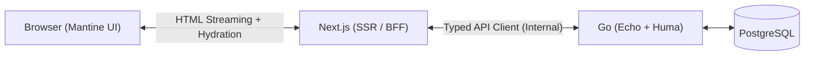
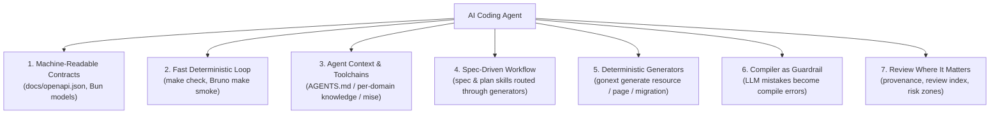

# gonext

An **AI-first Go + Next.js** framework: one right way to structure a project, deterministic generators for every slice, and a compiler and test loop shaped to catch an agent's mistakes before a human has to. A micro-kernel core with pluggable feature packs, generated by an interactive CLI, built for codebases where AI coding agents write most of the code and humans review where it matters.

This document is the **vision**: philosophy, architecture, and the full catalog of what gonext can generate. For the architecture as designed, see [roadmap.md](./roadmap.md); for build status and what's next, see the [project board](https://github.com/users/dennys-bd/projects/6).

---

## Getting Started

Host prerequisites are [`mise`](https://mise.jdx.dev/) and Docker; `mise` installs every other toolchain a project needs. Until `gonext` is published under an installable path (tracked in [#91](https://github.com/dennys-bd/gonext/issues/91)), build it from this repo:

```bash
brew install mise                       # see mise.jdx.dev for other platforms
mise use -g go node pnpm                # go + pnpm on PATH: what `gonext init` needs
git clone https://github.com/dennys-bd/gonext && make -C gonext install   # ~/go/bin/gonext
gonext init my-app
cd my-app && mise install && make db-up && make migrate && make hooks-install
```

`mise.toml` in the generated project pins the exact toolchain versions and holds the dev configuration as `[env]`; `mise.test.toml` and a gitignored `mise.local.toml` layer the test environment and your personal overrides on top — there is no `.env`. The `gonext` CLI itself never invokes `mise` — it only needs `go` and `pnpm` on `PATH`.

---

## Vision & Core Philosophy

1. **AI-First**:
   - gonext is designed for codebases where AI coding agents are the primary authors and humans review the decisions. Every other principle exists to serve that.
   - Traditional frameworks offer several ways to do the same thing, which suits an experienced human and misleads an agent. gonext has **one right way** per concern — route, model, service, migration, page — and treats a deviation as a build error, not a style nit.
   - The agent's first move is always a generator, never a hand-written skeleton; the framework's Go surface is shaped so the mistakes an LLM actually makes become compile errors; every generator emits its tests so the agent gets a closed loop; and each domain carries compact, self-contained context that fits in an agent's window without scanning the tree.
   - Because the framework knows what it generated, review can be aimed at what the agent decided and skip what the framework guarantees. See [AI-First & Agentic Development Architecture](#ai-first--agentic-development-architecture).
2. **Micro-Kernel + Pluggable Feature Packs**:
   - The core boilerplate remains lean and focused on high-performance foundational web services.
   - Feature capabilities (Authentication, Background Workers, Blob Storage, Transactional Email, Caching, Admin UI, Mobile, Embedded AI) are organized as **pluggable modules**.
3. **Interactive Scaffolding CLI (Zero Dead Code)**:
   - New projects are initialized using a generator CLI (e.g. `create-go-next` or `init-project.sh`).
   - When a feature pack is not selected by the developer, its code, dependencies, routes, and Docker containers are **completely omitted** from the generated project.
4. **Batteries Included for Local Development**:
   - Every external infrastructure dependency is paired with a zero-setup local container companion (e.g., Mailpit for emails, MinIO for S3 storage, Redis/Valkey for caching, Asynqmon/River UI for background workers).

---

## System Architecture Overview

```mermaid
flowchart TD
    CLI["Scaffolding CLI Generator<br/>(create-go-next / init-project)"]
    
    subgraph Core["Core Template (Micro-Kernel - Always Installed)"]
        CoreGo["Go Kernel<br/>(API Protocol Layer: REST default / GraphQL / gRPC<br/>+ slog + Config + Migrations)"]
        CoreNext["Next.js Core<br/>(App Router + Mantine UI + TypeScript)"]
        CoreDB["PostgreSQL<br/>(pgxpool + Goose/Golang-Migrate + Bun ORM)"]
        CoreAuth["Auth & RBAC<br/>(Argon2id + Secure Sessions/JWT + Role Middleware)"]
        CoreQA["QA & Testing<br/>(Testcontainers-Go + Bruno Smoke + Playwright)"]
        CoreAgent["Agent Guardrails<br/>(CLAUDE.md / AGENTS.md + mise + make check)"]
        CoreDX["Base DX<br/>(Docker Compose + Makefile)"]
    end
    
    subgraph Optional["Optional Feature Packs (Selected via CLI)"]
        QueuePack["Async Workers & Task Queues<br/>(None / River / Machinery / Watermill)"]
        EmailPack["Transactional Email<br/>(SMTP / Resend / SendGrid + Mailpit Dev Sandbox)"]
        StoragePack["Blob Storage<br/>(S3 / Cloudflare R2 / MinIO + Presigned URLs)"]
        CachePack["Cache & Distributed Rate Limiting<br/>(Redis / Valkey / In-Memory)"]
        ObsPack["Observability<br/>(Sentry Backend+Frontend / OpenTelemetry Traces)"]
        AdminPack["Admin Portal<br/>(Next.js /admin Route Group + Mantine UI)"]
        MobilePack["Mobile Frontend<br/>(Expo / React Native + Shared OpenAPI Client)"]
        GraphPack["Knowledge Graph<br/>(Graphify Codebase AST & Schema Map)"]
        AIPack["Embedded AI<br/>(Python service: LLM client / agents / RAG)"]
        DeployPack["Deployment Target<br/>(Docker Compose / Fly.io / Render / K8s)"]
    end

    CLI --> CoreGo
    CLI --> CoreNext
    CLI --> CoreDB
    CLI --> CoreAuth
    CLI --> CoreQA
    CLI --> CoreAgent
    CLI --> CoreDX
    
    CLI -.->|Selected| QueuePack
    CLI -.->|Selected| EmailPack
    CLI -.->|Selected| StoragePack
    CLI -.->|Selected| CachePack
    CLI -.->|Selected| ObsPack
    CLI -.->|Selected| AdminPack
    CLI -.->|Selected| MobilePack
    CLI -.->|Selected| GraphPack
    CLI -.->|Selected| AIPack
    CLI -.->|Selected| DeployPack
```



Build status for every box in this diagram lives on the [project board](https://github.com/users/dennys-bd/projects/6); [roadmap.md](./roadmap.md) describes what each one is and why.

---

## Pluggable Feature Packs & Candidate Options Matrix

> **Agent note**: when structuring a pack (or any config) based on this doc, think in complementary options — e.g. if a pack states S3, also plan the MinIO/LocalStack local-dev companion. Likewise, when adding a backend configuration, check whether an equivalent frontend configuration should exist, and vice versa.

### Feature Pack A: Background Workers & Task Queues

| Option | Engine / Technology | Dev Companion | Best Used For |
|---|---|---|---|
| **`none`** | None | None | Simple synchronous CRUD / API-only services. |
| **`postgres-river` (Recommended Lean)** | [River](https://riverqueue.com/) (Postgres-native) | River Web UI | **Lean Transactional Jobs**: Jobs enqueued inside DB transactions with zero extra infrastructure. |
| **`machinery` (Multi-Broker)** | [Machinery](https://github.com/RichardKnop/machinery) | Redis / RabbitMQ UI | **Multi-Broker Task Queue**: Supports swapping between Redis, RabbitMQ (AMQP), and AWS SQS with retries & workflows. |
| **`watermill` (Event-Driven)** | [Watermill](https://watermill.io/) | Kafka / Redpanda / RabbitMQ | **Event-Driven & Pub/Sub**: Message routing, event streaming (Kafka/RabbitMQ/Redis Streams), and CQRS architectures. |

### Feature Pack B: Transactional Email & Local Sandbox

| Driver | Description | Dev Sandbox |
|---|---|---|
| **Pluggable Mailer Interface** | Generic Go mailer interface with driver support for **Resend**, **SendGrid**, **Postmark**, or standard **SMTP**. | **Mailpit** Docker container (`localhost:8025`) captures all outbound emails locally with full HTML rendering and header inspection. |
| **Email Templating** | Go `html/template` or React Email components with dynamic variable interpolation. | Zero accidental external email sending during development or CI tests. |

### Feature Pack C: Object & Blob Storage

| Feature | Implementation | Dev Companion |
|---|---|---|
| **Presigned URL Direct Uploads** | Go backend generates short-lived, signed PUT/POST URLs; frontend uploads files directly to bucket. | **MinIO** Docker container (S3-compatible local server + console on port `9001`). |
| **Multi-Provider Driver** | AWS S3, Cloudflare R2, Google Cloud Storage, or local disk storage. | Avoids routing heavy file payloads through the backend API server. |

### Feature Pack D: Caching & Distributed Rate Limiting

| Feature | Implementation | Key Capabilities |
|---|---|---|
| **Cache Engine** | Redis / Valkey (`redis/go-redis/v9`) or In-Memory LRU | Cache-aside pattern, key expiration, cache invalidation helpers. |
| **Rate Limiter** | Distributed Sliding Window via Redis or Token Bucket | Protects public API endpoints from brute force and DoS attacks with standard `429 Too Many Requests` responses. |

### Feature Pack E: Observability, Error Tracking & Metrics

| Tool | Integration | Key Capabilities |
|---|---|---|
| **Sentry** | `sentry-go` + `@sentry/nextjs` | Automatic panic recovery and error capture with Next.js frontend error boundary tracking and CI source map uploads. |
| **OpenTelemetry (OTel) & Prometheus** | OTel Tracing + Prometheus `/metrics` | Distributed request tracing, HTTP latency histograms, database query timings, and Jaeger/Prometheus integration. |

### Feature Pack F: Admin & Backoffice Dashboard

| Component | Implementation | Features |
|---|---|---|
| **Next.js Admin Portal** | `app/(admin)/...` route group with Mantine UI + TanStack Table | User management (CRUD, invite, role assignment), Background worker status viewer, Audit logs, and Database statistics. |
| **Security Guard** | RBAC guard in Next.js layout + backend Huma authorization security schemes. | Restricts access exclusively to users with `admin` or `superuser` roles. |

### Feature Pack G: Mobile Frontend (Expo / React Native)

| Capability | Technology | Description |
|---|---|---|
| **Mobile Runtime** | [Expo](https://expo.dev/) (React Native + Expo Router) | Native iOS & Android apps with file-based routing and TypeScript. |
| **Shared API Client** | `@hey-api/client-fetch` (Generated from Go Huma) | 100% type-safe API requests, sharing contract types and models with `frontend/`. |
| **Auth & Secure Storage** | `expo-secure-store` | Hardware-backed keychain storage for JWTs/sessions with biometric unlock support. |
| **Monorepo Workspace** | `pnpm` workspaces (`mobile/`) | Unified dependencies and Makefile targets (`make mobile-ios`, `make mobile-android`). |

### Feature Pack H: Codebase Knowledge Graph (Graphify)

| Capability | Technology | Description |
|---|---|---|
| **Knowledge Graph Engine** | [Graphify](https://github.com/Graphify-Labs/graphify) | Local Tree-sitter AST parser mapping codebase relationships, components, and schemas. |
| **Agent Context Output** | `graph.json` + `GRAPH_REPORT.md` | Structured graph enabling AI coding agents to traverse dependencies without token bloat. |
| **Interactive Visualizer** | `graph.html` | Interactive browser-based visualization of the full-stack dependency graph. |
| **Makefile Automation** | `make graphify` | Automated command to extract and refresh the codebase knowledge graph. |
| *Future direction* | *Live service visibility* | *Tracked on the project board under `framework-gap`: turning this static, offline graph into a live view of the running service (Encore.dev-style), once the pack itself exists.* |

### Feature Pack I: Deployment Target

Builds directly on the Core Foundations' **Production Containerization** item (see roadmap.md) — this pack picks where those images actually run.

| Option | Engine / Technology | Best Used For |
|---|---|---|
| **`none`** | No deploy manifests generated | Local-only development, or a deploy pipeline owned entirely outside the template. |
| **`docker-compose-prod`** | `docker-compose.prod.yml` | Single-VM / self-hosted deployments with minimal moving parts. |
| **`fly`** | Fly.io (`fly.toml` + production `Dockerfile`) | Fast global-edge deploys for small-to-mid apps with near-zero infra ops. |
| **`render`** | Render (`render.yaml`) | Managed PaaS deploy with minimal configuration. |
| **`k8s`** | Kubernetes manifests (Deployment / Service / Ingress) | Teams already running Kubernetes clusters who need cloud portability. |

### Feature Pack J: Embedded AI

The pack that makes the *product* AI-capable, as opposed to the framework being AI-first about how it is built. The intended shape is a Python sub-project alongside `backend/` and `frontend/`, since that is where the AI ecosystem lives; beyond that the design is open.

| Capability | Candidate Shape | Open Question |
|---|---|---|
| **LLM Client** | Provider port with adapters (Anthropic, OpenAI, local) | Minimum surface vs. a fuller pack (agents, tools, RAG, vector store, evals). |
| **Backend Integration** | Python service called by the Go backend over the same OpenAPI-contract-first approach | How the contract extends to a third language, and whether it is base scaffold or `gonext add ai`. |
| **Dev Loop** | `gonext dev`, `make check`, CI and the golden tree accommodate Python | Toolchain pinning and test loop for the extra runtime. |

---

## Technology Stack & Feature Overview

| Capability Area | Selected Technology | Role & Architecture Purpose |
|---|---|---|
| **Backend Framework** | **Echo + Huma v2** | High-performance Go router with native OpenAPI 3.1 & request validation |
| **Frontend Framework** | **Next.js** (App Router) | Modern React 19 + TypeScript frontend with Server Components |
| **Mobile App Support** | **Expo / React Native (`mobile/`)** | Cross-platform mobile app with shared OpenAPI client & secure auth |
| **UI Component Library** | **Mantine UI** | Accessible, responsive UI component system with CSS modules |
| **Contract Sync & Reverse URLs** | **`@hey-api/openapi-ts` + `openapi-fetch`** | 100% type-safe reverse routing & auto-generated client SDK |
| **Background Tasks** | **River (Postgres)** / **Machinery (Redis/AMQP)** / **Watermill (PubSub)** | Transactional outbox, multi-broker queues, or event streaming |
| **Async Task Dashboard** | **River UI** / **RabbitMQ Console** / **Redpanda Console** | Real-time queue monitoring and worker health dashboard |
| **Database Migrations** | **Bun migrator** (`gonext migrate`) | Hand-written Postgres migrations registered with Bun, applied by a CLI-native subcommand — no migration binary vendored into the project |
| **Auth System** | **Modular Go Auth** | Argon2id + opaque HttpOnly cookie sessions + Role/Permission middleware (RBAC), behind a swappable provider port (JWT deliberately out of scope) |
| **Email Service** | **Pluggable Mailer** (Resend/SendGrid/SMTP) | Multi-driver mailer with local **Mailpit** sandbox |
| **Object Storage** | **S3 / Cloudflare R2 Client** | Direct-to-bucket pre-signed URL uploads + local **MinIO** server |
| **Error Monitoring** | **Sentry** (`sentry-go` + `@sentry/nextjs`) | Full-stack error capture, stack traces, and sourcemap uploads |
| **Codebase Knowledge Graph** | **Graphify** | Tree-sitter AST & schema graph for AI coding agents (`make graphify`) |
| **Admin Portal** | **Next.js `/admin` Route Group** | Backoffice management with Mantine & TanStack Table |
| **Dev Environment** | **Mise + Docker Compose + Makefile + Testcontainers** | Reproducible toolchains and isolated local services |
| **Deployment Target** | **Docker Compose (prod)** / **Fly.io** / **Render** / **Kubernetes manifests** | Selects where the production containers (see roadmap.md) actually run |

---

## Go + Next.js Hybrid Architecture & BFF Strategy

> This section walks through the **REST default path** (Go Tier = Echo + Huma). See roadmap.md's *API Protocol Layer* section for the GraphQL/gRPC alternatives and how they replace the Contract Sync layer described below.



### Division of Responsibilities

1. **Go (System of Record)**: Database transactions (Bun ORM, `pgxpool`), business logic, background workers (`River`/`Asynq`), high-throughput endpoints, and OpenAPI 3.1 schema.
2. **Next.js (Presentation & UI-BFF)**: React Server Components (RSC), Mantine UI components, SSR streaming, SEO metadata, asset optimization (`next/image`), and cookie middleware.

### Best of Both Worlds Capabilities

1. **Zero-Waterfall RSC**: Next.js fetches data from Go on the server over localhost and streams complete HTML directly to the browser (First Contentful Paint < 200ms).
2. **End-to-End Contract Sync**: Go Huma models auto-generate TypeScript clients (`make codegen`), ensuring 100% type safety at build time.
3. **BFF & Secure Cookie Management**: Next.js holds `HttpOnly` session cookies and executes route guards in `middleware.ts` before pages render.
4. **Hybrid Static & Dynamic Rendering**: Marketing pages use Static Site Generation (SSG/ISR) for CDN caching; dashboard apps use SSR.

---

## AI-First & Agentic Development Architecture



### 1. Machine-Readable Contracts (Zero Hallucinations)
* **Static OpenAPI 3.1 Export** (`docs/openapi.json`): Autonomously parsed by coding agents to build frontend components without guessing API payload shapes.
* **Bun Struct-Tag Models**: Go structs annotated with `bun` tags declare the schema mapping directly, so agents can read a model's tags to know its columns/relations without inferring them from hand-written SQL.

### 2. Fast Deterministic Verification Loops (< 5s Feedback)
* **`make check`**: Single agent command running backend linter (`golangci-lint`), Go tests, frontend typechecking (`tsc --noEmit`), and ESLint.
* **`make smoke`**: Automated Bruno CLI suite executing live HTTP assertions against endpoints (`assert { res.status: eq 200 }`).
* **`testcontainers-go`**: Ephemeral PostgreSQL containers spin up on demand during `go test`, eliminating manual mock maintenance.

### 3. Agent Context & Instruction Guardrails (`AGENTS.md` / `CLAUDE.md`)
* **Toolchain Pinning via `mise`**: Guarantees identical binaries (`go`, `pnpm`, `golangci-lint`, `bru`, `gonext` itself) across human and agent environments, and carries the local configuration as `[env]` layers so both see the same variables. Dependencies stay with `go.mod` and `pnpm`; the `gonext` CLI never depends on `mise`.
* **Architectural Boundaries**: Strict rules forbidding cross-domain leaks, circular imports, and unvalidated payload mutations — verified by `gonext doctor` / `make check`, so a deviation fails the loop instead of surviving as "works but ugly".
* **Per-Domain Knowledge Bundles**: Each domain ships a compact, self-contained manual in [Open Knowledge Format](https://cloud.google.com/blog/products/data-analytics/how-the-open-knowledge-format-can-improve-data-sharing) — what it owns, its layer rules, its public surface, the contract operations it implements, the generator to use, how to test it, and the invariants the code alone does not reveal. Emitted by the generators, validated like `AGENTS.md`, complementary to the Graphify AST graph (Pack H): the graph derives structure, the bundle records intent.

### 4. Spec-Driven Workflow (`docs/`)
* **`docs/superpowers/specs/`**: Architectural designs created and human-approved before writing code.
* **`docs/superpowers/plans/`**: Granular, test-driven task checklists with strict verification criteria.
* **Spec & Plan Skills**: The generated project ships the spec → plan flow itself, tool-neutral, and the plan names which `gonext generate ...` commands produce the skeleton — hand-written code is only what comes after.
* **`docs/bruno/`**: Executable API collection that doubles as executable documentation and smoke testing.

### 5. Deterministic Generators (The Agent's First Move)
* **Full slices, not snippets**: `gonext generate resource` produces model, migration, repository, service, handler, contract entry and the tests for each; `gonext generate page` produces the Next.js route, its action and its tests against the contract. The output is the agent's correct first draft, shrinking the space in which it can go wrong.
* **Tests as part of the contract**: Every generator emits runnable tests alongside the code, so the agent's loop is generate → run → fix, without a human writing tests afterwards.

### 6. Compiler as Guardrail
* Go already turns a hallucinated method name into a compile error. The framework's public surface (`httpx`, the published ports, generator output) is designed one step further: operation ids typed from the OpenAPI contract instead of bare strings, distinct types where two parameters of the same type sit side by side, exhaustive interfaces instead of manual registration — so the mistakes an LLM is likely to make are caught by `go build`, not at runtime.

### 7. Review Where It Matters
* **Provenance**: Generator output, framework boilerplate and agent-authored code are distinguishable, so tooling (and GitHub's `linguist-generated` collapse) can skip what the framework guarantees.
* **Review Index**: A change ships with a document, carried in the PR description, of what the agent did and how — generator commands run, files edited by hand, deviations and why — opening with the contract diff, since that is the product decision.
* **Verified, not declared**: CI replays the index's generator commands on a clean tree and diffs; what matches is proven, what differs is what the reviewer reads.
* **Risk zones**: Auth, migrations, published ports and the contract always require human review, via `CODEOWNERS` and a check, regardless of who wrote the change.

### Measured, Not Claimed
* The ai-first claim is benchmarked: the same task (add a resource with CRUD, migration and page) run by an agent on a gonext project and on equivalent projects in other frameworks, compared on tokens consumed and time to a tested result. The benchmark doubles as a regression check for the generators and guardrails.
