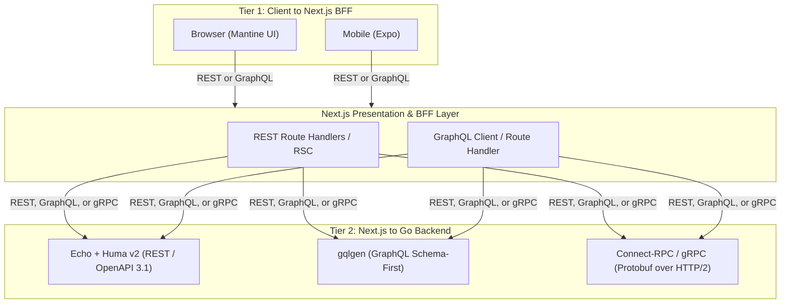

# Roadmap & Build Status

This document tracks implementation status, open design questions, and prioritized next steps for gonext. For the vision, architecture, and full feature-pack catalog, see [README.md](./README.md).

---

## Core Foundations (Always Included)

**Priority order for what's still `Pending` below:**

1. **Frontend-Backend Integration** — carries identity through the typed client.
2. **Scaffolding CLI — add & dev-loop generators** — CLI/dev-loop completeness, independent of Auth.
3. **Contract Sync & Reverse URLs**, **E2E Testing** (Playwright) — frontend/testing completeness, independent of Auth.
4. **Agent Guardrails (Codex/other)** (`AGENTS.md`), **Spec-Driven Docs Tree** — docs/guardrails completeness, independent of Auth.
5. **Security Baseline**, **Production Containerization** — production readiness, last since it hardens what the rest of this list builds.

| Component | Technology | Description | Status |
|---|---|---|---|
| **Backend Framework** | [Echo](https://echo.labstack.com/) + [Huma v2](https://huma.rocks/) | Fast Go HTTP router with automatic OpenAPI 3.1 schema generation and runtime validation. Default engine for the REST tier of the API Protocol Layer — see *API Protocol Layer* below for GraphQL/gRPC alternatives. | Done |
| **Server Lifecycle** | `signal.NotifyContext` | Graceful shutdown with connection draining on SIGTERM/SIGINT (`templates/backend/main.go`). | Done |
| **Configuration** | Typed Config + `mise` | Centralized type-safe environment configuration with `.env.example` validation. | Done |
| **Logging & Correlation** | Standard `log/slog` | Structured JSON logging with request correlation ID injection (`X-Request-ID`). | Done |
| **Database Layer** | PostgreSQL + `pgxpool` + [Bun](https://bun.uptrace.dev/) ORM | `pgxpool`-backed connection pool wrapped as a `database/sql` handle for Bun, giving struct-tag-mapped queries (`NewSelect`/`NewInsert`/etc.) with Postgres-aware pooling underneath (`templates/backend/internal/database/database.go`). | Done |
| **Schema Migrations** | Bun's own `migrate.NewMigrations()` | Hand-written Postgres schema migrations registered with Bun's migrator (`templates/backend/internal/database/migrations/`), applied via `gonext migrate` — a CLI-native subcommand (`internal/migrate`) that materializes a temp runner against the generated project rather than vendoring a `backend/cmd/migrate` binary into every project. Not `goose`/`golang-migrate` — earlier drafts of this table named the wrong tool. | Done |
| **Authentication & RBAC** | Argon2id + opaque cookie sessions + role/permission data | The `users/` track (`templates/backend/users/`): accounts, Argon2id password hashing, opaque `HttpOnly` cookie sessions stored as SHA-256 digests (`SessionIssuer`), email confirmation, password reset, and `Identity.HasRole`/`HasPermission` over a `role_permissions` join resolved in the same query that validates the session. Seven endpoints under `/users`. Registration rejects a taken email with `409` (uniqueness enforced by the DB constraint, so concurrent registrations cannot both win); `POST /users/password-reset` stays enumeration-safe. Ships a no-op `Notifier` (real mail is the Transactional Email pack's job). JWT/mobile sessions are deliberately out of scope — `SessionIssuer` is shaped so one can satisfy it later. | Done |
| **Auth Foundation** | Auth middleware + identity context injection | Huma middleware enforcing the requirement each operation declares in its OpenAPI `Security` field (`auth.Required`, `RequireRole`, `RequirePermission`, `Optional`) and injecting the resolved `Identity` into the handler's context, read through `httpx.Register`'s `*httpx.Ctx`. An operation declaring nothing never has its credential read, so public routes cost no lookup and a stale cookie cannot block re-login. `GET /users/me` and `POST /users/logout` are guarded by it; `POST /stubs` is the example track's reference. A `forbidigo` rule forbids bare `huma.Register` so no endpoint can bypass the wrapper. | Done |
| **Auth Provider Abstraction** | Swappable provider interface (Clerk / Supabase / Auth0 adapters) | The provider contract ships in gonext's core library as `github.com/dennys-bd/gonext/auth` (`auth/`), holding `Identity`, the `Resolver` port, the rule helpers and the context accessors. gonext is a single module under a single version, so the CLI a developer runs and the library their project imports are the same artifact at the same `vX.Y.Z`; `auth/` imports stdlib only, so taking that dependency compiles none of the CLI's own tree. Generated projects import it rather than vendoring it, so a third-party adapter — Clerk, Supabase, Auth0 — can ship as an installable module compiled against a stable type; a scaffolded port could not be implemented from outside the project at all. Swapping provider is a two-line change to `users.ProvideSessionIssuer`/`users.ProvideResolver` in `backend/wire.go`. `gonext init` pins the contract version the CLI was built against. | Done |
| **Health Probes** | `/healthz` & `/readyz` | Liveness and readiness endpoints with active database ping checks. | Done |
| **Frontend Framework** | [Next.js](https://nextjs.org/) (App Router) | Modern React 19 + TypeScript frontend with Server Components and Mantine UI. | Done |
| **Contract Sync & Reverse URLs** | `openapi-typescript` / `@hey-api/openapi-ts` + `openapi-fetch` | Auto-generated TypeScript types and type-safe reverse API URL client (`api.users.getById({ params: { id } })`), eliminating hardcoded URL strings. REST-tier client; GraphQL/gRPC tiers use their own codegen — see *API Protocol Layer* below. Not started: `frontend/lib/` is empty and no codegen dependency is installed. | **Pending** |
| **Integration & API Testing** | `testcontainers-go`, Bruno | Ephemeral container testing for Postgres (`testcontainers-go`) and API smoke tests (`make smoke`) against the full `docs/bruno/` request collection. | Done |
| **E2E Testing** | Playwright | Full-stack browser E2E testing. Not started: no Playwright dependency, config, or tests exist in `templates/frontend/`. | **Pending** |
| **Agent Guardrails (Claude)** | `CLAUDE.md`, `mise` | Pinned developer toolchains, architecture boundary rules, and single-command agent validation loops (`make check`) for Claude Code. | Done |
| **Agent Guardrails (Codex/other)** | `AGENTS.md` | Same guardrails as above, in the format other agent tools (Codex, etc.) read. Not started: no `AGENTS.md` exists in `templates/`. | **Pending** |
| **Bruno Request Collection** | `docs/bruno/` | Executable Bruno API request files (happy path + error cases per endpoint), doubling as the project's smoke test via `make smoke`. Previously shipped at the wrong path (`templates/bruno/`, not `templates/docs/bruno/`), so every generated project's `make smoke` failed and its own `CLAUDE.md` pointed at a directory that didn't exist — fixed. | Done |
| **Spec-Driven Docs Tree** | `docs/superpowers/{specs,plans}` | Structured architecture specifications and task breakdown plans, following this repo's own spec-driven workflow. Not started: no `docs/superpowers/` tree exists in `templates/` yet. | **Pending** |
| **Developer Ergonomics** | `mise`, `Makefile`, Docker Compose | Standardized toolchain management and one-command local dev environment. | Done |
| **Continuous Integration** | GitHub Actions (`templates/.github/workflows/ci.yml`) | CI workflow running backend & frontend tests, smoke tests, linting, and type checking on every push/PR. | Done |
| **Static Analysis** | `golangci-lint` (`.golangci.yml`) + `govulncheck` (`make vulncheck`) | Go linting and known-vulnerability scanning, alongside `tsc --noEmit` / ESLint on the frontend side (see `make check` in README.md). | Done |
| **Pre-commit & Secret Scanning** | `lefthook` + `gitleaks` (`.gitleaks.toml`) | Pre-commit hooks running formatting, lint, and secret scanning before a commit lands. | Done |
| **Scaffolding CLI — init** | `cmd/scaffold`, `gonext init` | Generates a new project from `templates/`: prompts for a slug, copies + substitutes the template tree, runs `go mod init`/`tidy` and `pnpm install`, and best-effort bootstraps Postgres. Verified byte-for-byte against the committed, runnable `golden/` dev tree via the golden-snapshot test (`cmd/scaffold/copy_golden_test.go`) — `golden/` is regenerated with `make golden` (`cmd/golden`), which backs up any existing tree first. Does not yet implement the full feature-pack selection prompt flow in *Scaffolding CLI Design Concept* below — today it only prompts for project name/path. | Done |
| **Scaffolding CLI — add & dev-loop generators** | `gonext add`, `gonext generate *`, `gonext doctor` (*CLI Commands* below) | Retrofitting a feature pack post-init, and the repeated day-to-day generators (migration, resource, worker, page, wire refresh, doctor). None of these subcommands exist yet — `cmd/scaffold` only implements `init`. | **Pending** |
| **Security Baseline** | Echo security-headers middleware, CORS config, baseline rate limiter | Security headers middleware, CORS configuration, and an in-process rate-limiting baseline applied to every generated project regardless of feature packs selected (distinct from Feature Pack D's distributed/Redis-backed limiter — see README.md). | **Pending** |
| **Frontend-Backend Integration** | Typed API client + data-fetching layer | Typed frontend API client wired into a data-fetching layer, with environment-based API base URL handling across dev/CI/prod. | **Pending** |
| **Production Containerization** | Multi-stage `Dockerfile`s (backend + frontend) | Production-grade multi-stage Docker builds for backend and frontend, with `make` targets and CI updated to build/run via Docker instead of host toolchains. Open question: whether `mise`-managed toolchains are still needed inside the image or can be dropped for a leaner runtime stage. Feeds directly into the Deployment Target feature pack (README.md), which selects the deploy target on top of these images. | **Pending** |
| **Backend Live-Reload** | `gonext dev` (`internal/dev`) | Watches `backend/` for `.go` changes and rebuilds/restarts the server automatically during `make run`, closing the local-dev hot-reload gap versus frameworks like Buffalo. Implemented as a `gonext` CLI subcommand rather than a vendored third-party watcher (`air`), so no generated project depends on or configures one; also regenerates `backend/main.go` from its canonical template before every build. | Done |

---

## API Protocol Layer (Two-Tier, Pluggable) — **Pending**

Core, not a Feature Pack — every generated project needs *some* way for the client tiers to talk to Go, so unlike the Feature Packs in README.md there is no `none` option here, only a choice of engine per tier. REST (Huma) is the default and the only tier currently implemented; GraphQL and gRPC are alternate engines swapped in at scaffold time.



| Boundary | Supported Protocols | Backend Engine | Client SDK |
|---|---|---|---|
| Frontend → Next.js (Tier 1) | REST | Next.js App Router / Server Actions | `fetch` / TanStack Query |
| Frontend → Next.js (Tier 1) | GraphQL | Next.js Route Handler | GraphQL Codegen + Urql / Apollo |
| Next.js → Go (Tier 2, Default) | REST | Echo + Huma v2 | `@hey-api/openapi-ts` + `openapi-fetch` |
| Next.js → Go (Tier 2) | GraphQL | [gqlgen](https://gqlgen.com/) | Typed GraphQL client / `graphql-request` |
| Next.js → Go (Tier 2) | gRPC | [Connect-RPC](https://connectrpc.com/) / gRPC-Go | `@connectrpc/connect-web` |

Scaffolding CLI prompts for this (see *Scaffolding CLI Design Concept* below) as two independent choices, since the two tiers can mix (e.g. REST to the browser, gRPC internally between Next.js and Go).

---

## Scaffolding CLI Design Concept

**Status: Partially done** — see *Scaffolding CLI — init* and *Scaffolding CLI — add & dev-loop generators* in *Core Foundations* above. `cmd/scaffold` exists and `gonext init` generates a project, but the interactive feature-pack selection flow below (background worker, email, blob storage, etc.) isn't implemented — today's `init` only prompts for a project name/path.

When generating a new repository from this template, the scaffolding tool (`cmd/scaffold` or `init-project.sh`) executes the following steps:

1. **Interactive Prompt**:
   ```text
   ? Project Name: my-saas-app
   ? Go Module Name: github.com/my-org/my-saas-app
   ? Choose Client -> Next.js Protocol (Tier 1):
     > [1] REST (App Router + Server Actions - Recommended)
       [2] GraphQL (GraphQL Route Handler + Codegen)
   ? Choose Next.js -> Go Protocol (Tier 2):
     > [1] REST (Echo + Huma OpenAPI 3.1 - Recommended)
       [2] gRPC / Connect-RPC (High-Speed Protobuf over HTTP/2)
       [3] GraphQL (gqlgen Schema-First)
   ? Choose Background Worker Engine:
     > [1] None (API Only)
       [2] PostgreSQL River (Recommended Lean - Zero Extra Infra)
       [3] Machinery (Multi-Broker Task Queue: Redis / RabbitMQ)
       [4] Watermill (Event-Driven: Kafka / RabbitMQ / PubSub)
   ? Enable Transactional Email (Resend/SMTP + Mailpit)? [Y/n]
   ? Enable S3/R2 Blob Storage (+ MinIO)? [Y/n]
   ? Enable Redis Caching & Rate Limiting? [Y/n]
   ? Enable Sentry Observability? [Y/n]
   ? Enable Graphify Knowledge Graph (AI agent codebase indexer)? [Y/n]
   ? Include Next.js Admin Dashboard (/admin)? [Y/n]
   ? Include Mobile App (Expo / React Native)? [Y/n]
   ? Choose Deployment Target:
     > [1] None (deploy pipeline handled outside the template)
       [2] Docker Compose (prod)
       [3] Fly.io
       [4] Render
       [5] Kubernetes manifests
   ```
2. **File & Dependency Pruning**:
   - Strips unselected packages from `backend/internal/`.
   - Strips unselected route groups from `frontend/src/app/`.
   - Dynamically constructs `docker-compose.yml` with only selected companion containers.
   - Updates `go.mod` and `package.json` to purge unused dependencies.
3. **Module Initialization**:
   - Replaces module paths and package names across all files.
   - Generates `.env` files from `.env.example`.
   - Runs initial migration and generates the OpenAPI client.

---

## CLI Commands: Scaffold-Time vs. Dev-Loop

The CLI has two distinct command families. **Scaffold-time** commands run once, at project generation (*Scaffolding CLI Design Concept* above) — they select feature packs and prune dead code. **Dev-loop** commands run repeatedly throughout the project's life, after generation, and are how the CLI keeps paying for itself day to day.

Dev-loop commands should be thin wrappers around existing `make` targets where one already exists (e.g. Postgres, wire DI), rather than duplicating that logic — the CLI adds the interactive/templated parts (name prompts, file generation, boilerplate insertion) on top.

### Scaffold-Time (run once)

| Command | Purpose |
|---|---|
| `gonext init` | Interactive prompt flow from the section above: select feature packs, prune unselected code, generate `.env`, run first migration. |
| `gonext add <pack>` | Retrofit a feature pack onto an already-generated project (not just at init) — e.g. add Redis caching to a project that started API-only. |

### Dev-Loop Generators (run repeatedly)

| Command | Wraps / Extends | Purpose |
|---|---|---|
| `gonext generate migration <name>` | new — no `make` target to wrap; the old `backend/cmd/migrate create` was removed when `gonext migrate` replaced its `up` counterpart, so this command has no `create` equivalent yet | Scaffold a new timestamped SQL migration file. |
| `gonext generate resource <name>` | new — composes Bun models/queries, Huma, Bruno | Full CRUD slice in one shot: migration + Bun model/query file + Huma handler + route registration + `docs/bruno/<Domain>/` request files (happy path + error cases), per the Bruno convention in `CLAUDE.md`. |
| `gonext generate worker <name>` | new (pack-gated) | New River/Machinery/Watermill job skeleton — only available if a background-worker pack was selected at init. |
| `gonext generate page <name>` | new | Next.js route + matching typed API client call via the generated OpenAPI client. |
| `gonext generate` (wire refresh) | `make generate` / `make generate-check` | Regenerate `wire_gen.go` from DI providers, or check it's not stale (same check already enforced in CI/pre-commit). |
| `gonext doctor` | `mise`, `make db-up`, `make lint` | Verify local toolchain versions match `.mise.toml`, DB is reachable, and no drift in generated files — a fast local health check before starting work. |

---

## Published Contract Candidates

A third code-placement category alongside *scaffoldable* (`templates/`) and *CLI-native* (`cmd/` + `internal/`): a small, stable port published as its own nested, dependency-free Go module that generated projects **import** rather than vendor, so an implementation can be written outside any single project. See `CLAUDE.md`, *Where does a new feature's code go?*.

The first one, `auth/` (`github.com/dennys-bd/gonext/auth`), is **built** — see *Auth Provider Abstraction* in *Core Foundations* above. It is a package of the single gonext module rather than a separately versioned one: gonext publishes one version covering both the CLI and the library.

**The bar:** a port with at least two plausible implementations, *one of which someone outside this repo might write*. The second clause does all the work. A scaffolded port lands at `<project>/backend/internal/…`, giving every generated project a structurally identical but distinct type at an `internal`-sealed import path — so no external implementation can exist at all. Publishing is justified only when that is the actual constraint, not merely when an interface looks reusable.

**The sequencing rule:** publish a port only once its *second* implementation actually exists. `auth` earns it because Clerk, Supabase and Auth0 are real, external and inevitable, so its shape is observed rather than guessed. A port with one implementation is a guess dressed as an abstraction — and unlike scaffolded code, a published contract cannot be withdrawn without breaking consumers. Every module published is a permanent semver commitment from a repo currently at v0.

| Candidate | Verdict | Notes |
|---|---|---|
| **Background worker** | **Next after auth** | The *Scaffolding CLI Design Concept* above already offers River, Machinery and Watermill as a scaffold-time engine choice. Three implementations of one concept is the definition of a port, and a third party writing a Temporal or SQS adapter is entirely plausible. Highest-value candidate once a worker pack exists. |
| **Blob storage** | **Publish** | `Put`/`Get`/`Delete`/`SignedURL` over S3, R2, GCS, Azure, MinIO or local disk. Well-understood shape, many real backends, low design risk. |
| **Notifier** (email, later SMS) | **Publish — but reshape first** | Already exists as `users/domain.Notifier`, but its methods are `SendConfirmation`/`SendAccountExistsNotice` — the users track's vocabulary, not a mailer's. A published port must be a generic `Send(ctx, Message)`, with the users track owning its own templates on top. Resend, SMTP, Postmark and SES are all real implementations. Blocked on the Transactional Email pack. |
| **Cache / rate limiter** | **Probably, later** | In-memory and Redis are two genuine implementations, and *Security Baseline* needs the limiter regardless. But cache interfaces leak badly — TTL semantics, invalidation, bytes vs. typed values — so this needs its own design pass rather than extraction from whatever ships first. |
| **Transactor** (`internal/database`) | **Undecided** | The transaction-boundary port is genuinely generic across Bun, pgx and sqlc, and *allow more db backends* is already in *Tech debts* below. But nobody outside writes a transactor for someone else's project, so it fails the second clause. Revisit only if multi-backend support materialises. |
| **PasswordHasher** | **No** | Argon2id, bcrypt and scrypt exist, but nobody ships third-party hasher adapters. An internal seam, not a contract. |
| **Repositories / `Store`** | **No** | Publishing these means publishing the users track's schema. That is coupling, not a contract. |
| **Tracing, metrics, logging** | **No — the contract already exists** | OpenTelemetry and `log/slog` *are* the published contracts. A `gonext/observability` port would reinvent them with fewer users. The best contract is frequently one someone else already published. |
| **API protocol layer, deployment targets** | **No** | Engine choices and static manifests. No runtime seam to abstract. |
| **OAuth** (*Tech debts* below) | **Already covered** | Another `auth.Resolver`, or a sibling port inside `auth/`. No new module. |

### Tracked: `httpx` may have to be published

The Auth Foundation design scaffolds `backend/internal/presentation/httpx` — the `huma.Register` wrapper that hands handlers a `*httpx.Ctx`. That is the right call while every feature pack is *generated into* a project.

It stops being the right call the moment a feature pack ships as an installable module instead. A third-party Redis rate limiter, or a background worker's admin routes, would need `httpx.Register` to mount an endpoint — and `httpx` is scaffolded, so it is a different type at a different `internal`-sealed path in every project: exactly the problem publishing `auth/` solves. Publishing it is not free either, since `httpx` imports Huma and would tie a published module's version to the API protocol engine.

So this is a decision deferred, not avoided: **if feature packs ever become installable modules rather than scaffolded code, `httpx` has to move into a published module first.** Directly relevant to the *Open plugin system* gap below.

---

## Gaps vs. Comparable Frameworks (Tracked)

Identified by comparing this roadmap against **create-t3-app**, **Buffalo** (gobuffalo.io), **Encore.dev**, and **RedwoodJS** — frameworks that overlap with this project's scaffolding-CLI + pluggable-stack philosophy. None of them combine Go + Next.js + AI-agent guardrails the way this roadmap does, but each covers at least one gap below that this roadmap does not yet address.

**Resolved and promoted out of this table**: Deployment/hosting story → *Deployment Target* feature pack (README.md, **Pending**); Swappable third-party auth → *Auth Provider Abstraction* (Core Foundations above, **Done**); Backend live-reload → *Backend Live-Reload* (Core Foundations above, **Done**). These are no longer open gaps — they have a decided home in one of the tables above instead.

| Gap | Seen In | Priority | Notes |
|---|---|---|---|
| **Infra-as-code / preview environments** | Encore.dev | Medium | Encore provisions matching cloud infra per environment from code-declared dependencies (queues, cron, secrets) and spins up automatic PR preview environments. No equivalent concept here. Deliberately kept separate from the Deployment Target feature pack (README.md): that pack generates static deploy manifests, it does not provision or manage infrastructure. Deferred — large scope jump, revisit only after that pack ships. |
| **Open plugin system** | Buffalo (`buffalo generate` plugins) | Low–Medium | Feature Packs A–I (README.md) are a fixed, curated list. No path for a third party to ship their own installable pack/generator. Deferred until the CLI (above) and existing packs are stable. *Published Contract Candidates* above is the groundwork: each published port is one plugin point, and that section's `httpx` note records what still blocks a pack from shipping as an installable module rather than generated code. Narrowed since this row was written: the auth port now *is* a published contract (`github.com/dennys-bd/gonext/auth`), so a third-party identity provider can already ship as an installable module compiled against a stable type — the first real plugin point in the tree. |
| **Live architecture/service visibility** | Encore.dev (auto-generated service catalog + tracing UI from running code) | Low | The Graphify pack (Feature Pack H, README.md) is similar in spirit but static/offline (`make graphify`) rather than live from a running service. Deferred — natural future enhancement to Pack H once it exists, not a new pack of its own. |

---

## Prioritized Next Steps

1. **Core Foundations** — see the priority order under *Core Foundations* above for the agreed sequence of what's still `Pending`.
2. **Finish the CLI's dev-loop** — `gonext add` + the `gonext generate *`/`doctor` commands (*Scaffolding CLI — add & dev-loop generators*, *Core Foundations* above) — `init` alone only proves the template can be generated once; these are what make the CLI keep paying for itself day to day.
3. **Ship the deploy story** — Production Containerization (above) → Deployment Target feature pack (README.md), in that order since the pack needs the images to exist first. This closes what was the single largest functional gap.
4. **API Protocol Layer alternates** (above) — REST is the default and needs no new design; GraphQL/gRPC engines are additive, layered on top of the CLI and microkernel work above.
5. **Formalize the remaining Feature Packs** (A, B, C, D, E, F, G, H — README.md) through the CLI, one at a time — lower design risk since the technology choices are already made.
6. **Deferred gaps** (above) — infra-as-code/preview environments, open plugin system, live architecture visibility. No committed design yet.


## Tech debts

- cleanup job for users domain
- allow more db backends
- migration check on startup
- SMS comm
- Oauth
- Remove itself
- Define mise usage
- snapshot testing
- fastapi wire under the hood?****