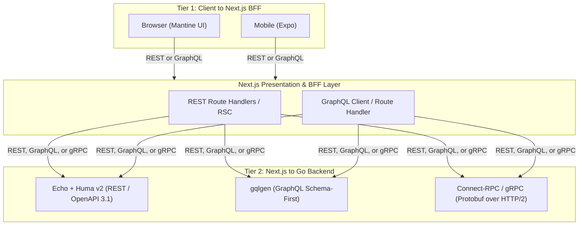

# Roadmap & Build Status

This document tracks implementation status, open design questions, and prioritized next steps for gonext. For the vision, architecture, and full feature-pack catalog, see [README.md](./README.md).

---

## Core Foundations (Always Included)

**Status legend**: `Templated` = code exists, but it's what was copied verbatim from `personal-life`, the SaaS app this template was extracted from — functionally correct there, but not yet adapted to be scaffold-safe (no pack-selection branching, possibly SaaS-specific assumptions baked in) or tested as a generated project's output. `Pending` = not built yet. Neither reaches a real "done" state until the CLI (*Prioritized Next Steps* below) exists to actually generate a project from it and prove it out.

| Component | Technology | Description | Status |
|---|---|---|---|
| **Backend Framework** | [Echo](https://echo.labstack.com/) + [Huma v2](https://huma.rocks/) | Fast Go HTTP router with automatic OpenAPI 3.1 schema generation and runtime validation. Default engine for the REST tier of the API Protocol Layer — see *API Protocol Layer* below for GraphQL/gRPC alternatives. | Templated |
| **Server Lifecycle** | `signal.NotifyContext` | Graceful shutdown with connection draining on SIGTERM/SIGINT (`templates/backend/cmd/server/main.go`). | Templated |
| **Configuration** | Typed Config + `mise` | Centralized type-safe environment configuration with `.env.example` validation. | Templated |
| **Logging & Correlation** | Standard `log/slog` | Structured JSON logging with request correlation ID injection (`X-Request-ID`). | Templated |
| **Database Layer** | PostgreSQL + `pgxpool` + [Bun](https://bun.uptrace.dev/) ORM | `pgxpool`-backed connection pool wrapped as a `database/sql` handle for Bun, giving struct-tag-mapped queries (`NewSelect`/`NewInsert`/etc.) with Postgres-aware pooling underneath (`templates/backend/internal/database/database.go`). | Templated |
| **Schema Migrations** | `goose` or `golang-migrate` | Versioned SQL migrations with dedicated Makefile targets and CI verification. | Templated |
| **Authentication & RBAC** | Argon2id + Sessions/JWT + Role Middleware | Built-in authentication (secure `HttpOnly` cookies / JWT), password hashing (Argon2id), password reset, and role permissions. | Templated |
| **Auth Foundation** | Auth middleware + identity context injection | Authentication middleware hook that runs on every Huma-routed request and injects the authenticated user's identity into the handler's context, so handlers can read "current user" without re-deriving it from the raw session/JWT each time. Distinct from Auth Provider Abstraction below (this is the wiring mechanism; that is the swappable provider). | **Pending** |
| **Auth Provider Abstraction** | Swappable provider interface (Clerk / Supabase / Auth0 adapters) | A provider-abstraction interface around the core auth module so the homegrown Argon2id/session implementation stays the default, but a project can swap in a third-party auth provider without restructuring the auth layer. Core (not a Feature Pack) since every project's identity boundary should be swappable from day one, not bolted on later. | **Pending** |
| **Health Probes** | `/healthz` & `/readyz` | Liveness and readiness endpoints with active database ping checks. | Templated |
| **Frontend Framework** | [Next.js](https://nextjs.org/) (App Router) | Modern React 19 + TypeScript frontend with Server Components and Mantine UI. | Templated |
| **Contract Sync & Reverse URLs** | `openapi-typescript` / `@hey-api/openapi-ts` + `openapi-fetch` | Auto-generated TypeScript types and type-safe reverse API URL client (`api.users.getById({ params: { id } })`), eliminating hardcoded URL strings. REST-tier client; GraphQL/gRPC tiers use their own codegen — see *API Protocol Layer* below. | Templated |
| **QA & Testing** | `testcontainers-go`, Bruno, Playwright | Ephemeral container testing for Postgres (`testcontainers-go`), API smoke tests (`make smoke`), and Playwright full-stack E2E. | Templated |
| **Agentic Guardrails** | `AGENTS.md`, `CLAUDE.md`, `mise` | Pinned developer toolchains, architecture boundary rules, and single-command agent validation loops (`make check`). | Templated |
| **Spec-Driven Tree** | `docs/superpowers/{specs,plans}` + `docs/bruno` | Structured architecture specifications, task breakdown plans, and executable Bruno API request files. | Templated |
| **Developer Ergonomics** | `mise`, `Makefile`, Docker Compose | Standardized toolchain management and one-command local dev environment. | Templated |
| **Continuous Integration** | GitHub Actions (`templates/.github/workflows/ci.yml`) | CI workflow running backend & frontend tests, smoke tests, linting, and type checking on every push/PR. | Templated |
| **Static Analysis** | `golangci-lint` (`.golangci.yml`) + `govulncheck` (`make vulncheck`) | Go linting and known-vulnerability scanning, alongside `tsc --noEmit` / ESLint on the frontend side (see `make check` in README.md). | Templated |
| **Pre-commit & Secret Scanning** | `lefthook` + `gitleaks` (`.gitleaks.toml`) | Pre-commit hooks running formatting, lint, and secret scanning before a commit lands. | Templated |
| **Security Baseline** | Echo security-headers middleware, CORS config, baseline rate limiter | Security headers middleware, CORS configuration, and an in-process rate-limiting baseline applied to every generated project regardless of feature packs selected (distinct from Feature Pack D's distributed/Redis-backed limiter — see README.md). | **Pending** |
| **Frontend-Backend Integration** | Typed API client + data-fetching layer | Typed frontend API client wired into a data-fetching layer, with environment-based API base URL handling across dev/CI/prod. | **Pending** |
| **Production Containerization** | Multi-stage `Dockerfile`s (backend + frontend) | Production-grade multi-stage Docker builds for backend and frontend, with `make` targets and CI updated to build/run via Docker instead of host toolchains. Open question: whether `mise`-managed toolchains are still needed inside the image or can be dropped for a leaner runtime stage. Feeds directly into the Deployment Target feature pack (README.md), which selects the deploy target on top of these images. | **Pending** |
| **Backend Live-Reload** | [`air`](https://github.com/air-verse/air) | Watches Go source changes and restarts the server automatically during `make run`, closing the local-dev hot-reload gap versus frameworks like Buffalo. | **Pending** |

---

## API Protocol Layer (Two-Tier, Pluggable) — **Pending**

Core, not a Feature Pack — every generated project needs *some* way for the client tiers to talk to Go, so unlike the Feature Packs in README.md there is no `none` option here, only a choice of engine per tier. REST (Huma) is the default and the only tier currently implemented; GraphQL and gRPC are alternate engines swapped in at scaffold time.



| Boundary | Supported Protocols | Backend Engine | Client SDK |
|---|---|---|---|
| Frontend → Next.js (Tier 1) | REST | Next.js App Router / Server Actions | `fetch` / TanStack Query |
| Frontend → Next.js (Tier 1) | GraphQL | Next.js Route Handler | GraphQL Codegen + Urql / Apollo |
| Next.js → Go (Tier 2, Default) | REST | Echo + Huma v2 | `@hey-api/openapi-ts` + `openapi-fetch` |
| Next.js → Go (Tier 2) | GraphQL | [gqlgen](https://gqlgen.com/) | Typed GraphQL client / `graphql-request` |
| Next.js → Go (Tier 2) | gRPC | [Connect-RPC](https://connectrpc.com/) / gRPC-Go | `@connectrpc/connect-web` |

Scaffolding CLI prompts for this (see *Scaffolding CLI Design Concept* below) as two independent choices, since the two tiers can mix (e.g. REST to the browser, gRPC internally between Next.js and Go).

---

## Scaffolding CLI Design Concept

**Status: Pending** — `cmd/scaffold` does not exist yet; this section is planned, not implemented.

When generating a new repository from this template, the scaffolding tool (`cmd/scaffold` or `init-project.sh`) executes the following steps:

1. **Interactive Prompt**:
   ```text
   ? Project Name: my-saas-app
   ? Go Module Name: github.com/my-org/my-saas-app
   ? Choose Client -> Next.js Protocol (Tier 1):
     > [1] REST (App Router + Server Actions - Recommended)
       [2] GraphQL (GraphQL Route Handler + Codegen)
   ? Choose Next.js -> Go Protocol (Tier 2):
     > [1] REST (Echo + Huma OpenAPI 3.1 - Recommended)
       [2] gRPC / Connect-RPC (High-Speed Protobuf over HTTP/2)
       [3] GraphQL (gqlgen Schema-First)
   ? Choose Background Worker Engine:
     > [1] None (API Only)
       [2] PostgreSQL River (Recommended Lean - Zero Extra Infra)
       [3] Machinery (Multi-Broker Task Queue: Redis / RabbitMQ)
       [4] Watermill (Event-Driven: Kafka / RabbitMQ / PubSub)
   ? Enable Transactional Email (Resend/SMTP + Mailpit)? [Y/n]
   ? Enable S3/R2 Blob Storage (+ MinIO)? [Y/n]
   ? Enable Redis Caching & Rate Limiting? [Y/n]
   ? Enable Sentry Observability? [Y/n]
   ? Enable Graphify Knowledge Graph (AI agent codebase indexer)? [Y/n]
   ? Include Next.js Admin Dashboard (/admin)? [Y/n]
   ? Include Mobile App (Expo / React Native)? [Y/n]
   ? Choose Deployment Target:
     > [1] None (deploy pipeline handled outside the template)
       [2] Docker Compose (prod)
       [3] Fly.io
       [4] Render
       [5] Kubernetes manifests
   ```
2. **File & Dependency Pruning**:
   - Strips unselected packages from `backend/internal/`.
   - Strips unselected route groups from `frontend/src/app/`.
   - Dynamically constructs `docker-compose.yml` with only selected companion containers.
   - Updates `go.mod` and `package.json` to purge unused dependencies.
3. **Module Initialization**:
   - Replaces module paths and package names across all files.
   - Generates `.env` files from `.env.example`.
   - Runs initial migration and generates the OpenAPI client.

---

## CLI Commands: Scaffold-Time vs. Dev-Loop

The CLI has two distinct command families. **Scaffold-time** commands run once, at project generation (*Scaffolding CLI Design Concept* above) — they select feature packs and prune dead code. **Dev-loop** commands run repeatedly throughout the project's life, after generation, and are how the CLI keeps paying for itself day to day.

Dev-loop commands should be thin wrappers around existing `make` targets where one already exists (e.g. Postgres, wire DI), rather than duplicating that logic — the CLI adds the interactive/templated parts (name prompts, file generation, boilerplate insertion) on top.

### Scaffold-Time (run once)

| Command | Purpose |
|---|---|
| `gonext init` | Interactive prompt flow from the section above: select feature packs, prune unselected code, generate `.env`, run first migration. |
| `gonext add <pack>` | Retrofit a feature pack onto an already-generated project (not just at init) — e.g. add Redis caching to a project that started API-only. |

### Dev-Loop Generators (run repeatedly)

| Command | Wraps / Extends | Purpose |
|---|---|---|
| `gonext generate migration <name>` | `make migrate-create NAME=<name>` | Scaffold a new timestamped SQL migration file. |
| `gonext generate resource <name>` | new — composes Bun models/queries, Huma, Bruno | Full CRUD slice in one shot: migration + Bun model/query file + Huma handler + route registration + `docs/bruno/<Domain>/` request files (happy path + error cases), per the Bruno convention in `CLAUDE.md`. |
| `gonext generate worker <name>` | new (pack-gated) | New River/Machinery/Watermill job skeleton — only available if a background-worker pack was selected at init. |
| `gonext generate page <name>` | new | Next.js route + matching typed API client call via the generated OpenAPI client. |
| `gonext generate` (wire refresh) | `make generate` / `make generate-check` | Regenerate `wire_gen.go` from DI providers, or check it's not stale (same check already enforced in CI/pre-commit). |
| `gonext doctor` | `mise`, `make db-up`, `make lint` | Verify local toolchain versions match `.mise.toml`, DB is reachable, and no drift in generated files — a fast local health check before starting work. |

---

## Gaps vs. Comparable Frameworks (Tracked)

Identified by comparing this roadmap against **create-t3-app**, **Buffalo** (gobuffalo.io), **Encore.dev**, and **RedwoodJS** — frameworks that overlap with this project's scaffolding-CLI + pluggable-stack philosophy. None of them combine Go + Next.js + AI-agent guardrails the way this roadmap does, but each covers at least one gap below that this roadmap does not yet address.

**Resolved and promoted out of this table**: Deployment/hosting story → *Deployment Target* feature pack (README.md); Swappable third-party auth → *Auth Provider Abstraction* (Core Foundations above); Backend live-reload → *Backend Live-Reload* (Core Foundations above). These are no longer open gaps — they have a decided home and a **Pending** status there.

| Gap | Seen In | Priority | Notes |
|---|---|---|---|
| **Infra-as-code / preview environments** | Encore.dev | Medium | Encore provisions matching cloud infra per environment from code-declared dependencies (queues, cron, secrets) and spins up automatic PR preview environments. No equivalent concept here. Deliberately kept separate from the Deployment Target feature pack (README.md): that pack generates static deploy manifests, it does not provision or manage infrastructure. Deferred — large scope jump, revisit only after that pack ships. |
| **Open plugin system** | Buffalo (`buffalo generate` plugins) | Low–Medium | Feature Packs A–I (README.md) are a fixed, curated list. No path for a third party to ship their own installable pack/generator. Deferred until the CLI (above) and existing packs are stable. |
| **Live architecture/service visibility** | Encore.dev (auto-generated service catalog + tracing UI from running code) | Low | The Graphify pack (Feature Pack H, README.md) is similar in spirit but static/offline (`make graphify`) rather than live from a running service. Deferred — natural future enhancement to Pack H once it exists, not a new pack of its own. |

---

## Prioritized Next Steps

1. **Build the actual CLI** (`cmd/scaffold`, *Scaffolding CLI Design Concept* + *CLI Commands* above) — the literal product deliverable, built first because it's also the only way the `Templated` rows in *Core Foundations* become real: the CLI is what actually generates a project from this code, which is what forces the SaaS-specific assumptions out of it and lets it be tested as a template's output rather than as the original app.
2. **Harden the microkernel** — in dependency order: Backend Live-Reload → Security Baseline → Auth Foundation → Auth Provider Abstraction → Frontend-Backend Integration (all in *Core Foundations* above). Small and mostly self-contained, except the two Auth items, which come before Frontend-Backend Integration since more code will accrete on top of them (mechanism first, then swappability).
3. **Ship the deploy story** — Production Containerization (above) → Deployment Target feature pack (README.md), in that order since the pack needs the images to exist first. This closes what was the single largest functional gap.
4. **API Protocol Layer alternates** (above) — REST is the `Templated` default and needs no new design; GraphQL/gRPC engines are additive, layered on top of the CLI and microkernel work above.
5. **Formalize the remaining Feature Packs** (A, B, C, D, E, F, G, H — README.md) through the CLI, one at a time — lower design risk since the technology choices are already made.
6. **Deferred gaps** (above) — infra-as-code/preview environments, open plugin system, live architecture visibility. No committed design yet.
