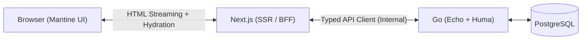
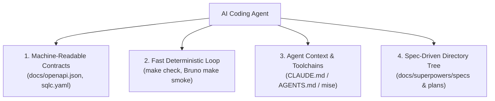

# Boilerplate Roadmap & Architecture Possibilities

This document tracks the vision, feature matrix, and architectural possibilities for turning this monorepo into a production-grade **Go + Next.js Boilerplate**.

---

## 1. Vision & Core Philosophy

1. **Micro-Kernel + Pluggable Feature Packs**:
   - The core boilerplate remains lean and focused on high-performance foundational web services.
   - Feature capabilities (Authentication, Background Workers, Blob Storage, Transactional Email, Caching, Admin UI, Mobile) are organized as **pluggable modules**.
2. **Interactive Scaffolding CLI (Zero Dead Code)**:
   - New projects are initialized using a generator CLI (e.g. `create-go-next` or `init-project.sh`).
   - When a feature pack is not selected by the developer, its code, dependencies, routes, and Docker containers are **completely omitted** from the generated project.
3. **Batteries Included for Local Development**:
   - Every external infrastructure dependency is paired with a zero-setup local container companion (e.g., Mailpit for emails, MinIO for S3 storage, Redis/Valkey for caching, Asynqmon/River UI for background workers).
4. **AI-First & Spec-Driven Development (Agentic-Ready)**:
   - Built to empower autonomous AI coding agents with machine-readable contracts (OpenAPI 3.1, `sqlc`), deterministic fast feedback loops (`make check`, `make smoke`), and standard spec/plan workflows (`docs/`).

---

## 2. System Architecture Overview

```mermaid
flowchart TD
    CLI["Scaffolding CLI Generator<br/>(create-go-next / init-project)"]
    
    subgraph Core["Core Template (Micro-Kernel - Always Installed)"]
        CoreGo["Go Kernel<br/>(Echo + Huma OpenAPI 3.1 + slog + Config + Migrations)"]
        CoreNext["Next.js Core<br/>(App Router + Mantine UI + TypeScript)"]
        CoreDB["PostgreSQL<br/>(pgxpool + Goose/Golang-Migrate + sqlc)"]
        CoreAuth["Auth & RBAC<br/>(Argon2id + Secure Sessions/JWT + Role Middleware)"]
        CoreQA["QA & Testing<br/>(Testcontainers-Go + Bruno Smoke + Playwright)"]
        CoreAgent["Agent Guardrails<br/>(CLAUDE.md / AGENTS.md + mise + make check)"]
        CoreDX["Base DX<br/>(Docker Compose + Makefile)"]
    end
    
    subgraph Optional["Optional Feature Packs (Selected via CLI)"]
        QueuePack["Async Workers & Task Queues<br/>(None / River / Machinery / Watermill)"]
        EmailPack["Transactional Email<br/>(SMTP / Resend / SendGrid + Mailpit Dev Sandbox)"]
        StoragePack["Blob Storage<br/>(S3 / Cloudflare R2 / MinIO + Presigned URLs)"]
        CachePack["Cache & Distributed Rate Limiting<br/>(Redis / Valkey / In-Memory)"]
        ObsPack["Observability<br/>(Sentry Backend+Frontend / OpenTelemetry Traces)"]
        AdminPack["Admin Portal<br/>(Next.js /admin Route Group + Mantine UI)"]
        MobilePack["Mobile Frontend<br/>(Expo / React Native + Shared OpenAPI Client)"]
        GraphPack["Knowledge Graph<br/>(Graphify Codebase AST & Schema Map)"]
    end

    CLI --> CoreGo
    CLI --> CoreNext
    CLI --> CoreDB
    CLI --> CoreAuth
    CLI --> CoreQA
    CLI --> CoreAgent
    CLI --> CoreDX
    
    CLI -.->|Selected| QueuePack
    CLI -.->|Selected| EmailPack
    CLI -.->|Selected| StoragePack
    CLI -.->|Selected| CachePack
    CLI -.->|Selected| ObsPack
    CLI -.->|Selected| AdminPack
    CLI -.->|Selected| MobilePack
    CLI -.->|Selected| GraphPack
```



---

## 3. Core Foundations (Always Included)

| Component | Technology | Description |
|---|---|---|
| **Backend Framework** | [Echo](https://echo.labstack.com/) + [Huma v2](https://huma.rocks/) | Fast Go HTTP router with automatic OpenAPI 3.1 schema generation and runtime validation. |
| **Configuration** | Typed Config + `mise` | Centralized type-safe environment configuration with `.env.example` validation. |
| **Logging & Correlation** | Standard `log/slog` | Structured JSON logging with request correlation ID injection (`X-Request-ID`). |
| **Database Layer** | PostgreSQL + `pgxpool` + `sqlc` | High-performance connection pooling with compile-time type-safe SQL query generation. |
| **Schema Migrations** | `goose` or `golang-migrate` | Versioned SQL migrations with dedicated Makefile targets and CI verification. |
| **Authentication & RBAC** | Argon2id + Sessions/JWT + Role Middleware | Built-in authentication (secure `HttpOnly` cookies / JWT), password hashing (Argon2id), password reset, and role permissions. |
| **Health Probes** | `/healthz` & `/readyz` | Liveness and readiness endpoints with active database ping checks. |
| **Frontend Framework** | [Next.js](https://nextjs.org/) (App Router) | Modern React 19 + TypeScript frontend with Server Components and Mantine UI. |
| **Contract Sync & Reverse URLs** | `openapi-typescript` / `@hey-api/openapi-ts` + `openapi-fetch` | Auto-generated TypeScript types and type-safe reverse API URL client (`api.users.getById({ params: { id } })`), eliminating hardcoded URL strings. |
| **QA & Testing** | `testcontainers-go`, Bruno, Playwright | Ephemeral container testing for Postgres (`testcontainers-go`), API smoke tests (`make smoke`), and Playwright full-stack E2E. |
| **Agentic Guardrails** | `AGENTS.md`, `CLAUDE.md`, `mise` | Pinned developer toolchains, architecture boundary rules, and single-command agent validation loops (`make check`). |
| **Spec-Driven Tree** | `docs/superpowers/{specs,plans}` + `docs/bruno` | Structured architecture specifications, task breakdown plans, and executable Bruno API request files. |
| **Developer Ergonomics** | `mise`, `Makefile`, Docker Compose | Standardized toolchain management and one-command local dev environment. |

---

## 4. Pluggable Feature Packs & Candidate Options Matrix

### Feature Pack A: Background Workers & Task Queues

| Option | Engine / Technology | Dev Companion | Best Used For |
|---|---|---|---|
| **`none`** | None | None | Simple synchronous CRUD / API-only services. |
| **`postgres-river` (Recommended Lean)** | [River](https://riverqueue.com/) (Postgres-native) | River Web UI | **Lean Transactional Jobs**: Jobs enqueued inside DB transactions with zero extra infrastructure. |
| **`machinery` (Multi-Broker)** | [Machinery](https://github.com/RichardKnop/machinery) | Redis / RabbitMQ UI | **Multi-Broker Task Queue**: Supports swapping between Redis, RabbitMQ (AMQP), and AWS SQS with retries & workflows. |
| **`watermill` (Event-Driven)** | [Watermill](https://watermill.io/) | Kafka / Redpanda / RabbitMQ | **Event-Driven & Pub/Sub**: Message routing, event streaming (Kafka/RabbitMQ/Redis Streams), and CQRS architectures. |

### Feature Pack B: Transactional Email & Local Sandbox

| Driver | Description | Dev Sandbox |
|---|---|---|
| **Pluggable Mailer Interface** | Generic Go mailer interface with driver support for **Resend**, **SendGrid**, **Postmark**, or standard **SMTP**. | **Mailpit** Docker container (`localhost:8025`) captures all outbound emails locally with full HTML rendering and header inspection. |
| **Email Templating** | Go `html/template` or React Email components with dynamic variable interpolation. | Zero accidental external email sending during development or CI tests. |

### Feature Pack C: Object & Blob Storage

| Feature | Implementation | Dev Companion |
|---|---|---|
| **Presigned URL Direct Uploads** | Go backend generates short-lived, signed PUT/POST URLs; frontend uploads files directly to bucket. | **MinIO** Docker container (S3-compatible local server + console on port `9001`). |
| **Multi-Provider Driver** | AWS S3, Cloudflare R2, Google Cloud Storage, or local disk storage. | Avoids routing heavy file payloads through the backend API server. |

### Feature Pack D: Caching & Distributed Rate Limiting

| Feature | Implementation | Key Capabilities |
|---|---|---|
| **Cache Engine** | Redis / Valkey (`redis/go-redis/v9`) or In-Memory LRU | Cache-aside pattern, key expiration, cache invalidation helpers. |
| **Rate Limiter** | Distributed Sliding Window via Redis or Token Bucket | Protects public API endpoints from brute force and DoS attacks with standard `429 Too Many Requests` responses. |

### Feature Pack E: Observability, Error Tracking & Metrics

| Tool | Integration | Key Capabilities |
|---|---|---|
| **Sentry** | `sentry-go` + `@sentry/nextjs` | Automatic panic recovery and error capture with Next.js frontend error boundary tracking and CI source map uploads. |
| **OpenTelemetry (OTel) & Prometheus** | OTel Tracing + Prometheus `/metrics` | Distributed request tracing, HTTP latency histograms, database query timings, and Jaeger/Prometheus integration. |

### Feature Pack F: Admin & Backoffice Dashboard

| Component | Implementation | Features |
|---|---|---|
| **Next.js Admin Portal** | `app/(admin)/...` route group with Mantine UI + TanStack Table | User management (CRUD, invite, role assignment), Background worker status viewer, Audit logs, and Database statistics. |
| **Security Guard** | RBAC guard in Next.js layout + backend Huma authorization security schemes. | Restricts access exclusively to users with `admin` or `superuser` roles. |

### Feature Pack G: Mobile Frontend (Expo / React Native)

| Capability | Technology | Description |
|---|---|---|
| **Mobile Runtime** | [Expo](https://expo.dev/) (React Native + Expo Router) | Native iOS & Android apps with file-based routing and TypeScript. |
| **Shared API Client** | `@hey-api/client-fetch` (Generated from Go Huma) | 100% type-safe API requests, sharing contract types and models with `frontend/`. |
| **Auth & Secure Storage** | `expo-secure-store` | Hardware-backed keychain storage for JWTs/sessions with biometric unlock support. |
| **Monorepo Workspace** | `pnpm` workspaces (`mobile/`) | Unified dependencies and Makefile targets (`make mobile-ios`, `make mobile-android`). |

### Feature Pack H: Codebase Knowledge Graph (Graphify)

| Capability | Technology | Description |
|---|---|---|
| **Knowledge Graph Engine** | [Graphify](https://github.com/Graphify-Labs/graphify) | Local Tree-sitter AST parser mapping codebase relationships, components, and schemas. |
| **Agent Context Output** | `graph.json` + `GRAPH_REPORT.md` | Structured graph enabling AI coding agents to traverse dependencies without token bloat. |
| **Interactive Visualizer** | `graph.html` | Interactive browser-based visualization of the full-stack dependency graph. |
| **Makefile Automation** | `make graphify` | Automated command to extract and refresh the codebase knowledge graph. |

---

## 5. Technology Stack & Feature Overview

| Capability Area | Selected Technology | Role & Architecture Purpose |
|---|---|---|
| **Backend Framework** | **Echo + Huma v2** | High-performance Go router with native OpenAPI 3.1 & request validation |
| **Frontend Framework** | **Next.js** (App Router) | Modern React 19 + TypeScript frontend with Server Components |
| **Mobile App Support** | **Expo / React Native (`mobile/`)** | Cross-platform mobile app with shared OpenAPI client & secure auth |
| **UI Component Library** | **Mantine UI** | Accessible, responsive UI component system with CSS modules |
| **Contract Sync & Reverse URLs** | **`@hey-api/openapi-ts` + `openapi-fetch`** | 100% type-safe reverse routing & auto-generated client SDK |
| **Background Tasks** | **River (Postgres)** / **Machinery (Redis/AMQP)** / **Watermill (PubSub)** | Transactional outbox, multi-broker queues, or event streaming |
| **Async Task Dashboard** | **River UI** / **RabbitMQ Console** / **Redpanda Console** | Real-time queue monitoring and worker health dashboard |
| **Database Migrations** | **Goose** / **Golang-Migrate** | SQL-first schema migrations with rollback support |
| **Auth System** | **Modular Go Auth** | Argon2id + Secure HttpOnly sessions/JWT + Role Middleware (RBAC) |
| **Email Service** | **Pluggable Mailer** (Resend/SendGrid/SMTP) | Multi-driver mailer with local **Mailpit** sandbox |
| **Object Storage** | **S3 / Cloudflare R2 Client** | Direct-to-bucket pre-signed URL uploads + local **MinIO** server |
| **Error Monitoring** | **Sentry** (`sentry-go` + `@sentry/nextjs`) | Full-stack error capture, stack traces, and sourcemap uploads |
| **Codebase Knowledge Graph** | **Graphify** | Tree-sitter AST & schema graph for AI coding agents (`make graphify`) |
| **Admin Portal** | **Next.js `/admin` Route Group** | Backoffice management with Mantine & TanStack Table |
| **Dev Environment** | **Mise + Docker Compose + Makefile + Testcontainers** | Reproducible toolchains and isolated local services |

---

## 6. Scaffolding CLI Design Concept

When generating a new repository from this template, the scaffolding tool (`cmd/scaffold` or `init-project.sh`) executes the following steps:

1. **Interactive Prompt**:
   ```text
   ? Project Name: my-saas-app
   ? Go Module Name: github.com/my-org/my-saas-app
   ? Choose Background Worker Engine:
     > [1] None (API Only)
       [2] PostgreSQL River (Recommended Lean - Zero Extra Infra)
       [3] Machinery (Multi-Broker Task Queue: Redis / RabbitMQ)
       [4] Watermill (Event-Driven: Kafka / RabbitMQ / PubSub)
   ? Enable Transactional Email (Resend/SMTP + Mailpit)? [Y/n]
   ? Enable S3/R2 Blob Storage (+ MinIO)? [Y/n]
   ? Enable Redis Caching & Rate Limiting? [Y/n]
   ? Enable Sentry Observability? [Y/n]
   ? Enable Graphify Knowledge Graph (AI agent codebase indexer)? [Y/n]
   ? Include Next.js Admin Dashboard (/admin)? [Y/n]
   ? Include Mobile App (Expo / React Native)? [Y/n]
   ```
2. **File & Dependency Pruning**:
   - Strips unselected packages from `backend/internal/`.
   - Strips unselected route groups from `frontend/src/app/`.
   - Dynamically constructs `docker-compose.yml` with only selected companion containers.
   - Updates `go.mod` and `package.json` to purge unused dependencies.
3. **Module Initialization**:
   - Replaces module paths and package names across all files.
   - Generates `.env` files from `.env.example`.
   - Runs initial migration and generates the OpenAPI client.

---

## 7. Go + Next.js Hybrid Architecture & BFF Strategy



### Division of Responsibilities

1. **Go (System of Record)**: Database transactions (`sqlc`, `pgxpool`), business logic, background workers (`River`/`Asynq`), high-throughput endpoints, and OpenAPI 3.1 schema.
2. **Next.js (Presentation & UI-BFF)**: React Server Components (RSC), Mantine UI components, SSR streaming, SEO metadata, asset optimization (`next/image`), and cookie middleware.

### Best of Both Worlds Capabilities

1. **Zero-Waterfall RSC**: Next.js fetches data from Go on the server over localhost and streams complete HTML directly to the browser (First Contentful Paint < 200ms).
2. **End-to-End Contract Sync**: Go Huma models auto-generate TypeScript clients (`make codegen`), ensuring 100% type safety at build time.
3. **BFF & Secure Cookie Management**: Next.js holds `HttpOnly` session cookies and executes route guards in `middleware.ts` before pages render.
4. **Hybrid Static & Dynamic Rendering**: Marketing pages use Static Site Generation (SSG/ISR) for CDN caching; dashboard apps use SSR.

---

## 8. CLI Commands: Scaffold-Time vs. Dev-Loop

The CLI has two distinct command families. **Scaffold-time** commands run once, at project generation (Section 6) — they select feature packs and prune dead code. **Dev-loop** commands run repeatedly throughout the project's life, after generation, and are how the CLI keeps paying for itself day to day.

Dev-loop commands should be thin wrappers around existing `make` targets where one already exists (e.g. Postgres, wire DI), rather than duplicating that logic — the CLI adds the interactive/templated parts (name prompts, file generation, boilerplate insertion) on top.

### Scaffold-Time (run once)

| Command | Purpose |
|---|---|
| `gonext init` | Interactive prompt flow from Section 6: select feature packs, prune unselected code, generate `.env`, run first migration. |
| `gonext add <pack>` | Retrofit a feature pack onto an already-generated project (not just at init) — e.g. add Redis caching to a project that started API-only. |

### Dev-Loop Generators (run repeatedly)

| Command | Wraps / Extends | Purpose |
|---|---|---|
| `gonext generate migration <name>` | `make migrate-create NAME=<name>` | Scaffold a new timestamped SQL migration file. |
| `gonext generate resource <name>` | new — composes `sqlc`, Huma, Bruno | Full CRUD slice in one shot: migration + `sqlc` query file + Huma handler + route registration + `docs/bruno/<Domain>/` request files (happy path + error cases), per the Bruno convention in `CLAUDE.md`. |
| `gonext generate worker <name>` | new (pack-gated) | New River/Machinery/Watermill job skeleton — only available if a background-worker pack was selected at init. |
| `gonext generate page <name>` | new | Next.js route + matching typed API client call via the generated OpenAPI client. |
| `gonext generate` (wire refresh) | `make generate` / `make generate-check` | Regenerate `wire_gen.go` from DI providers, or check it's not stale (same check already enforced in CI/pre-commit). |
| `gonext doctor` | `mise`, `make db-up`, `make lint` | Verify local toolchain versions match `.mise.toml`, DB is reachable, and no drift in generated files — a fast local health check before starting work. |

---

## 9. AI-First & Agentic Development Architecture



### 1. Machine-Readable Contracts (Zero Hallucinations)
* **Static OpenAPI 3.1 Export** (`docs/openapi.json`): Autonomously parsed by coding agents to build frontend components without guessing API payload shapes.
* **`sqlc` SQL-First Layer**: SQL queries stored in `.sql` files; Go structs and methods generated at compile-time with strict type verification.

### 2. Fast Deterministic Verification Loops (< 5s Feedback)
* **`make check`**: Single agent command running backend linter (`golangci-lint`), Go tests, frontend typechecking (`tsc --noEmit`), and ESLint.
* **`make smoke`**: Automated Bruno CLI suite executing live HTTP assertions against endpoints (`assert { res.status: eq 200 }`).
* **`testcontainers-go`**: Ephemeral PostgreSQL containers spin up on demand during `go test`, eliminating manual mock maintenance.

### 3. Agent Context & Instruction Guardrails (`AGENTS.md` / `CLAUDE.md`)
* **Toolchain Pinning via `mise`**: Guarantees identical binaries (`go`, `pnpm`, `golangci-lint`, `goose`, `bru`) across human and agent environments.
* **Architectural Boundaries**: Strict rules forbidding cross-domain leaks, circular imports, and unvalidated payload mutations.

### 4. Spec-Driven Workflow Tree (`docs/`)
* **`docs/superpowers/specs/`**: Architectural designs created and human-approved before writing code.
* **`docs/superpowers/plans/`**: Granular, test-driven task checklists with strict verification criteria.
* **`docs/bruno/`**: Executable API collection that doubles as executable documentation and smoke testing.

---

## 10. Gaps vs. Comparable Frameworks (Tracked)

Identified by comparing this roadmap against **create-t3-app**, **Buffalo** (gobuffalo.io), **Encore.dev**, and **RedwoodJS** — frameworks that overlap with this project's scaffolding-CLI + pluggable-stack philosophy. None of them combine Go + Next.js + AI-agent guardrails the way this roadmap does, but each covers at least one gap below that this roadmap does not yet address.

| Gap | Seen In | Priority | Notes |
|---|---|---|---|
| **Deployment / hosting story** | RedwoodJS (`redwood deploy`), Encore.dev (automatic cloud provisioning) | **High** | Roadmap stops at local dev (Section 6 scaffolding, Section 3 Core DX). No documented path from generated project to a Docker image, Fly/Render/Vercel adapter, or CI/CD deploy template. |
| **Infra-as-code / preview environments** | Encore.dev | Medium | Encore provisions matching cloud infra per environment from code-declared dependencies (queues, cron, secrets) and spins up automatic PR preview environments. No equivalent concept here. |
| **Swappable third-party auth** | RedwoodJS (Clerk/Supabase/Auth0/dbAuth) | Medium | Core Auth (Section 3) is homegrown Argon2id + sessions only, with no pluggable-provider abstraction for teams that want to offload auth. |
| **Open plugin system** | Buffalo (`buffalo generate` plugins) | Low–Medium | Feature Packs A–H (Section 4) are a fixed, curated list. No path for a third party to ship their own installable pack/generator. |
| **Backend live-reload** | Buffalo (via `air`) | Low | Core DX (Section 3) lists Docker Compose + Makefile only; `make run` has no hot-reload loop for Go source changes. |
| **Live architecture/service visibility** | Encore.dev (auto-generated service catalog + tracing UI from running code) | Low | The Graphify pack (Feature Pack H) is similar in spirit but static/offline (`make graphify`) rather than live from a running service. |

Recommended order of attack: **deployment story first** — it's the largest functional hole and blocks the "vision → real project" jump entirely; the rest are incremental DX improvements.


