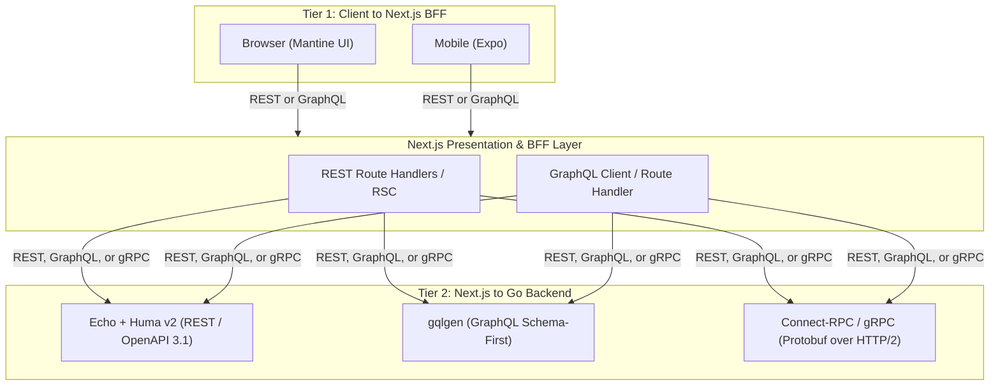

# Architecture & Design Reference

This document describes gonext's architecture **as designed** — what each component is, which technology it uses, and why. For the product vision and the full feature-pack catalog, see [README.md](./README.md).

gonext's scope was set by benchmarking against **create-t3-app**, **Buffalo** (gobuffalo.io), **Encore.dev** and **RedwoodJS** — the frameworks that overlap with its scaffolding-CLI + pluggable-stack philosophy. None of them combine Go + Next.js + AI-agent guardrails the way this design does, but each covers ground worth borrowing from.

**It does not track status.** What is built, what is in flight, and what is next all live on the project board:

**→ [gonext project board](https://github.com/users/dennys-bd/projects/6)**

Work is filed as issues in this repository and grouped there by label:

| Label | Covers |
|---|---|
| [`core-foundation`](https://github.com/dennys-bd/gonext/issues?q=is%3Aissue+label%3Acore-foundation) | Components from *Core Foundations* below that are still to build. |
| [`framework-gap`](https://github.com/dennys-bd/gonext/issues?q=is%3Aissue+label%3Aframework-gap) | Gaps found by comparing gonext against create-t3-app, Buffalo, Encore.dev and RedwoodJS. |
| [`tech-debt`](https://github.com/dennys-bd/gonext/issues?q=is%3Aissue+label%3Atech-debt) | Tracked debt and open questions against what already ships. |

---

## Core Foundations (Always Included)

Every generated project gets all of these, regardless of which feature packs were selected. Rows describe the intended design; the board says which are live.

| Component | Technology | Description |
|---|---|---|
| **Backend Framework** | [Echo](https://echo.labstack.com/) + [Huma v2](https://huma.rocks/) | Fast Go HTTP router with automatic OpenAPI 3.1 schema generation and runtime validation. Default engine for the REST tier of the API Protocol Layer — see *API Protocol Layer* below for GraphQL/gRPC alternatives. |
| **Server Lifecycle** | `signal.NotifyContext` | Graceful shutdown with connection draining on SIGTERM/SIGINT (`templates/backend/main.go`). |
| **Configuration** | Typed Config + `mise` | Centralized type-safe environment configuration with `.env.example` validation. |
| **Logging & Correlation** | Standard `log/slog` | Structured JSON logging with request correlation ID injection (`X-Request-ID`). |
| **Database Layer** | PostgreSQL + `pgxpool` + [Bun](https://bun.uptrace.dev/) ORM | `pgxpool`-backed connection pool wrapped as a `database/sql` handle for Bun, giving struct-tag-mapped queries (`NewSelect`/`NewInsert`/etc.) with Postgres-aware pooling underneath (`templates/backend/internal/database/database.go`). |
| **Schema Migrations** | Bun's own `migrate.NewMigrations()` | Hand-written Postgres schema migrations registered with Bun's migrator (`templates/backend/internal/database/migrations/`), applied via `gonext migrate` — a CLI-native subcommand (`internal/migrate`) that materializes a temp runner against the generated project rather than vendoring a `backend/cmd/migrate` binary into every project. Not `goose`/`golang-migrate` — earlier drafts named the wrong tool. |
| **Authentication & RBAC** | Argon2id + opaque cookie sessions + role/permission data | The `users/` track (`templates/backend/users/`): accounts, Argon2id password hashing, opaque `HttpOnly` cookie sessions stored as SHA-256 digests (`SessionIssuer`), email confirmation, password reset, and `Identity.HasRole`/`HasPermission` over a `role_permissions` join resolved in the same query that validates the session. Seven endpoints under `/users`. Registration rejects a taken email with `409` (uniqueness enforced by the DB constraint, so concurrent registrations cannot both win); `POST /users/password-reset` stays enumeration-safe. Ships a no-op `Notifier` (real mail is the Transactional Email pack's job). JWT/mobile sessions are deliberately out of scope — `SessionIssuer` is shaped so one can satisfy it later. |
| **Auth Foundation** | Auth middleware + identity context injection | Huma middleware enforcing the requirement each operation declares in its OpenAPI `Security` field (`auth.Required`, `RequireRole`, `RequirePermission`, `Optional`) and injecting the resolved `Identity` into the handler's context, read through `httpx.Register`'s `*httpx.Ctx`. An operation declaring nothing never has its credential read, so public routes cost no lookup and a stale cookie cannot block re-login. `GET /users/me` and `POST /users/logout` are guarded by it; `POST /stubs` is the example track's reference. A `forbidigo` rule forbids bare `huma.Register` so no endpoint can bypass the wrapper. |
| **Auth Provider Abstraction** | Swappable provider interface (Clerk / Supabase / Auth0 adapters) | The provider contract ships in gonext's core library as `github.com/dennys-bd/gonext/auth` (`auth/`), holding `Identity`, the `Resolver` port, the rule helpers and the context accessors. gonext is a single module under a single version, so the CLI a developer runs and the library their project imports are the same artifact at the same `vX.Y.Z`; `auth/` imports stdlib only, so taking that dependency compiles none of the CLI's own tree. Generated projects import it rather than vendoring it, so a third-party adapter — Clerk, Supabase, Auth0 — can ship as an installable module compiled against a stable type; a scaffolded port could not be implemented from outside the project at all. Swapping provider is a two-line change to `users.ProvideSessionIssuer`/`users.ProvideResolver` in `backend/wire.go`. `gonext init` pins the contract version the CLI was built against. |
| **Health Probes** | `/healthz` & `/readyz` | Liveness and readiness endpoints with active database ping checks. |
| **Frontend Framework** | [Next.js](https://nextjs.org/) (App Router) | Modern React 19 + TypeScript frontend with Server Components and Mantine UI. |
| **Contract Sync & Reverse URLs** | `openapi-typescript` / `@hey-api/openapi-ts` + `openapi-fetch` | Auto-generated TypeScript types and type-safe reverse API URL client (`api.users.getById({ params: { id } })`), eliminating hardcoded URL strings. REST-tier client; GraphQL/gRPC tiers use their own codegen — see *API Protocol Layer* below. |
| **Frontend-Backend Integration** | Typed API client + data-fetching layer | Typed frontend API client wired into a data-fetching layer, with environment-based API base URL handling across dev/CI/prod. Carries identity through the typed client. |
| **Integration & API Testing** | `testcontainers-go`, Bruno | Ephemeral container testing for Postgres (`testcontainers-go`) and API smoke tests (`make smoke`) against the full `docs/bruno/` request collection. |
| **E2E Testing** | Playwright | Full-stack browser E2E testing. |
| **Agent Guardrails (Claude)** | `CLAUDE.md`, `mise` | Pinned developer toolchains, architecture boundary rules, and single-command agent validation loops (`make check`) for Claude Code. |
| **Agent Guardrails (Codex/other)** | `AGENTS.md` | The same guardrails, in the format other agent tools (Codex, etc.) read. |
| **Bruno Request Collection** | `docs/bruno/` | Executable Bruno API request files (happy path + error cases per endpoint), doubling as the project's smoke test via `make smoke`. |
| **Spec-Driven Docs Tree** | `docs/superpowers/{specs,plans}` | Structured architecture specifications and task breakdown plans, following this repo's own spec-driven workflow. |
| **Developer Ergonomics** | `mise`, `Makefile`, Docker Compose | Standardized toolchain management and one-command local dev environment. |
| **Continuous Integration** | GitHub Actions (`templates/.github/workflows/ci.yml`) | CI workflow running backend & frontend tests, smoke tests, linting, and type checking on every push/PR. |
| **Static Analysis** | `golangci-lint` (`.golangci.yml`) + `govulncheck` (`make vulncheck`) | Go linting and known-vulnerability scanning, alongside `tsc --noEmit` / ESLint on the frontend side (see `make check` in README.md). |
| **Pre-commit & Secret Scanning** | `lefthook` + `gitleaks` (`.gitleaks.toml`) | Pre-commit hooks running formatting, lint, and secret scanning before a commit lands. |
| **Security Baseline** | Echo security-headers middleware, CORS config, baseline rate limiter | Security headers middleware, CORS configuration, and an in-process rate-limiting baseline applied to every generated project regardless of feature packs selected (distinct from Feature Pack D's distributed/Redis-backed limiter — see README.md). |
| **Scaffolding CLI — init** | `cmd/scaffold`, `gonext init` | Generates a new project from `templates/`: prompts for a slug, copies + substitutes the template tree, runs `go mod init`/`tidy` and `pnpm install`, and best-effort bootstraps Postgres. Verified byte-for-byte against the committed, runnable `golden/` dev tree via the golden-snapshot test (`cmd/scaffold/copy_golden_test.go`) — `golden/` is regenerated with `make golden` (`cmd/golden`), which backs up any existing tree first. |
| **Scaffolding CLI — add & dev-loop generators** | `gonext add`, `gonext generate *`, `gonext doctor` (*CLI Commands* below) | Retrofitting a feature pack post-init, and the repeated day-to-day generators (migration, resource, worker, page, wire refresh, doctor). |
| **Backend Live-Reload** | `gonext dev` (`internal/dev`) | Watches `backend/` for `.go` changes and rebuilds/restarts the server automatically during `make run`, closing the local-dev hot-reload gap versus frameworks like Buffalo. Implemented as a `gonext` CLI subcommand rather than a vendored third-party watcher (`air`), so no generated project depends on or configures one; also regenerates `backend/main.go` from its canonical template before every build. |
| **Production Containerization** | Multi-stage `Dockerfile`s (backend + frontend) | Production-grade multi-stage Docker builds for backend and frontend, with `make` targets and CI updated to build/run via Docker instead of host toolchains. Feeds directly into the Deployment Target feature pack (README.md), which selects the deploy target on top of these images. |

---

## API Protocol Layer (Two-Tier, Pluggable)

Core, not a Feature Pack — every generated project needs *some* way for the client tiers to talk to Go, so unlike the Feature Packs in README.md there is no `none` option here, only a choice of engine per tier. REST (Huma) is the default; GraphQL and gRPC are alternate engines swapped in at scaffold time.



| Boundary | Supported Protocols | Backend Engine | Client SDK |
|---|---|---|---|
| Frontend → Next.js (Tier 1) | REST | Next.js App Router / Server Actions | `fetch` / TanStack Query |
| Frontend → Next.js (Tier 1) | GraphQL | Next.js Route Handler | GraphQL Codegen + Urql / Apollo |
| Next.js → Go (Tier 2, Default) | REST | Echo + Huma v2 | `@hey-api/openapi-ts` + `openapi-fetch` |
| Next.js → Go (Tier 2) | GraphQL | [gqlgen](https://gqlgen.com/) | Typed GraphQL client / `graphql-request` |
| Next.js → Go (Tier 2) | gRPC | [Connect-RPC](https://connectrpc.com/) / gRPC-Go | `@connectrpc/connect-web` |

The scaffolding CLI prompts for this (see *Scaffolding CLI Design Concept* below) as two independent choices, since the two tiers can mix (e.g. REST to the browser, gRPC internally between Next.js and Go).

---

## Scaffolding CLI Design Concept

When generating a new repository from this template, the scaffolding tool (`cmd/scaffold`) executes the following steps:

1. **Interactive Prompt**:
   ```text
   ? Project Name: my-saas-app
   ? Go Module Name: github.com/my-org/my-saas-app
   ? Choose Client -> Next.js Protocol (Tier 1):
     > [1] REST (App Router + Server Actions - Recommended)
       [2] GraphQL (GraphQL Route Handler + Codegen)
   ? Choose Next.js -> Go Protocol (Tier 2):
     > [1] REST (Echo + Huma OpenAPI 3.1 - Recommended)
       [2] gRPC / Connect-RPC (High-Speed Protobuf over HTTP/2)
       [3] GraphQL (gqlgen Schema-First)
   ? Choose Background Worker Engine:
     > [1] None (API Only)
       [2] PostgreSQL River (Recommended Lean - Zero Extra Infra)
       [3] Machinery (Multi-Broker Task Queue: Redis / RabbitMQ)
       [4] Watermill (Event-Driven: Kafka / RabbitMQ / PubSub)
   ? Enable Transactional Email (Resend/SMTP + Mailpit)? [Y/n]
   ? Enable S3/R2 Blob Storage (+ MinIO)? [Y/n]
   ? Enable Redis Caching & Rate Limiting? [Y/n]
   ? Enable Sentry Observability? [Y/n]
   ? Enable Graphify Knowledge Graph (AI agent codebase indexer)? [Y/n]
   ? Include Next.js Admin Dashboard (/admin)? [Y/n]
   ? Include Mobile App (Expo / React Native)? [Y/n]
   ? Choose Deployment Target:
     > [1] None (deploy pipeline handled outside the template)
       [2] Docker Compose (prod)
       [3] Fly.io
       [4] Render
       [5] Kubernetes manifests
   ```
2. **File & Dependency Pruning**:
   - Strips unselected packages from `backend/internal/`.
   - Strips unselected route groups from `frontend/src/app/`.
   - Dynamically constructs `docker-compose.yml` with only selected companion containers.
   - Updates `go.mod` and `package.json` to purge unused dependencies.
3. **Module Initialization**:
   - Replaces module paths and package names across all files.
   - Generates `.env` files from `.env.example`.
   - Runs initial migration and generates the OpenAPI client.

---

## CLI Commands: Scaffold-Time vs. Dev-Loop

The CLI has two distinct command families. **Scaffold-time** commands run once, at project generation (*Scaffolding CLI Design Concept* above) — they select feature packs and prune dead code. **Dev-loop** commands run repeatedly throughout the project's life, after generation, and are how the CLI keeps paying for itself day to day.

Dev-loop commands should be thin wrappers around existing `make` targets where one already exists (e.g. Postgres, wire DI), rather than duplicating that logic — the CLI adds the interactive/templated parts (name prompts, file generation, boilerplate insertion) on top.

Scaffold-time is `gonext init` — the prompt flow above, plus pruning and the first migration. `gonext add <pack>` belongs to the same family, retrofitting a pack onto an already-generated project.

Dev-loop is `gonext migrate` and `gonext dev` today. The generator set that fills it out — migration, resource, worker, page, wire refresh, doctor — is tracked on the board rather than inventoried here.

---

## Published Contract Candidates

A third code-placement category alongside *scaffoldable* (`templates/`) and *CLI-native* (`cmd/` + `internal/`): a small, stable port published in gonext's own module that generated projects **import** rather than vendor, so an implementation can be written outside any single project. See `CLAUDE.md`, *Where does a new feature's code go?*.

The first one, `auth/` (`github.com/dennys-bd/gonext/auth`), is built — see *Auth Provider Abstraction* in *Core Foundations* above. It is a package of the single gonext module rather than a separately versioned one: gonext publishes one version covering both the CLI and the library. `httpx` is the second — see *`httpx` is published* below, which is also the one place the sequencing rule is deliberately not followed.

**The bar:** a port with at least two plausible implementations, *one of which someone outside this repo might write*. The second clause does all the work. A scaffolded port lands at `<project>/backend/internal/…`, giving every generated project a structurally identical but distinct type at an `internal`-sealed import path — so no external implementation can exist at all. Publishing is justified only when that is the actual constraint, not merely when an interface looks reusable.

**The sequencing rule:** publish a port only once its *second* implementation actually exists. `auth` earns it because Clerk, Supabase and Auth0 are real, external and inevitable, so its shape is observed rather than guessed. A port with one implementation is a guess dressed as an abstraction — and unlike scaffolded code, a published contract cannot be withdrawn without breaking consumers. Every contract published is a permanent semver commitment from a repo currently at v0.

Candidates that clear the bar and are queued for publishing are tracked on the board. What stays here is the set of **settled decisions** — the ports deliberately *not* published, and the one waiting on something else — because those are what stop the same proposals coming back.

| Candidate | Verdict | Why |
|---|---|---|
| **PasswordHasher** | **No** | Argon2id, bcrypt and scrypt exist, but nobody ships third-party hasher adapters. An internal seam, not a contract. |
| **Repositories / `Store`** | **No** | Publishing these means publishing the users track's schema. That is coupling, not a contract. |
| **Tracing, metrics, logging** | **No — the contract already exists** | OpenTelemetry and `log/slog` *are* the published contracts. A `gonext/observability` port would reinvent them with fewer users. The best contract is frequently one someone else already published. |
| **API protocol layer, deployment targets** | **No** | Engine choices and static manifests. No runtime seam to abstract. |
| **OAuth** | **Already covered** | Another `auth.Resolver`, or a sibling port inside `auth/`. No new module needed. |
| **Transactor** (`internal/database`) | **Conditional** | The transaction-boundary port is genuinely generic across Bun, pgx and sqlc. But nobody outside writes a transactor for someone else's project, so it fails the second clause of the bar. Revisit only if multi-backend support actually materialises. |

### `httpx` is published

`httpx` — the `huma.Register` wrapper handing handlers a `*httpx.Ctx`, and the `Group` carrying a track's path prefix, OpenAPI tag and error policy — is a published package of this module, not scaffolded into generated projects.

It was originally scaffolded, and this section previously recorded the publication as deferred until feature packs became installable modules rather than generated code. That deferral was lifted ahead of its own trigger: the reason to publish does not actually depend on the plugin system existing yet, only on the intent to have one. A scaffolded `httpx` is a structurally identical but *distinct* type at an `internal`-sealed path in every generated project, so a third-party feature pack — a Redis rate limiter, a background worker's admin routes — cannot mount an endpoint at all. That is the same constraint publishing `auth/` solved, and it is unfixable from outside a project by construction rather than by omission.

Two costs are accepted deliberately, and both are real:

- **A published contract pinned to the API protocol engine.** `httpx` imports Huma. `auth/` is stdlib-only precisely so a consuming project compiles none of this repo's dependency tree, and `httpx` does not have that property. A Huma major version becomes a gonext major version.
- **The bar above is not met on its own terms.** The rule is that a port earns publication once its second implementation exists and someone outside the repo might plausibly write one. `httpx` has one implementation, so this is published on an architectural argument rather than an observed shape — the one deliberate exception to the sequencing rule, made because the alternative is not a worse abstraction but no extension point at all.

Tracked as an open issue on the board; the package's shape depends on how the module split is resolved, since a Huma-importing package sits badly in a module whose selling point is a small dependency footprint.
